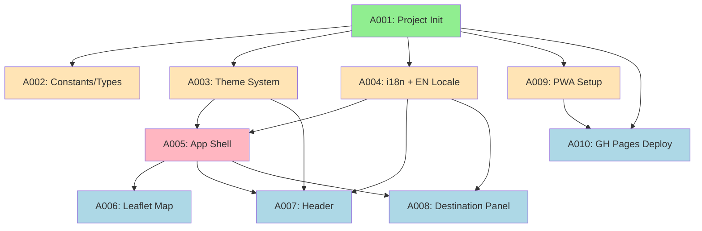

# Phase A Reference — Foundation & Scaffolding

**Project:** WeatherEscape
**Phase:** A
**Total Prompts:** 10
**Batches:** 4

---

## Status Table

| ID | Prompt | Status | Depends On | Batch | Complexity |
|----|--------|--------|------------|-------|------------|
| A001 | Project Initialization | ⬜ | — | 1 | L |
| A002 | Constants & Type Definitions | ⬜ | A001 | 2 | S |
| A003 | Theme System | ⬜ | A001 | 2 | M |
| A004 | i18n Framework + EN Locale | ⬜ | A001 | 2 | M |
| A009 | PWA Setup | ⬜ | A001 | 2 | M |
| A005 | App Shell (Root Component) | ⬜ | A001, A003, A004 | 3 | M |
| A006 | Leaflet Map Component | ⬜ | A001, A005 | 4 | M |
| A007 | Header Component | ⬜ | A003, A004, A005 | 4 | M |
| A008 | Destination Panel Skeleton | ⬜ | A004, A005 | 4 | S |
| A010 | GitHub Pages Deployment | ⬜ | A001, A009 | 4 | S |

**Status legend:** ⬜ Not Started | 🔄 In Progress | ✅ Complete | ❌ Rejected | ⏸️ Blocked

---

## Dependency Visualization

**Color key:** 🟢 Green = Batch 1 (no deps) | 🟡 Yellow = Batch 2 | 🩷 Pink = Batch 3 | 🔵 Blue = Batch 4

---

## Batch Execution Plan

### Batch 1 (no dependencies)
- A001: Project Initialization

### Batch 2 (depends on Batch 1 ✅)
- A002: Constants & Type Definitions
- A003: Theme System
- A004: i18n Framework + EN Locale
- A009: PWA Setup

### Batch 3 (depends on Batch 2 ✅)
- A005: App Shell (Root Component)

### Batch 4 (depends on Batch 3 ✅)
- A006: Leaflet Map Component
- A007: Header Component
- A008: Destination Panel Skeleton
- A010: GitHub Pages Deployment
